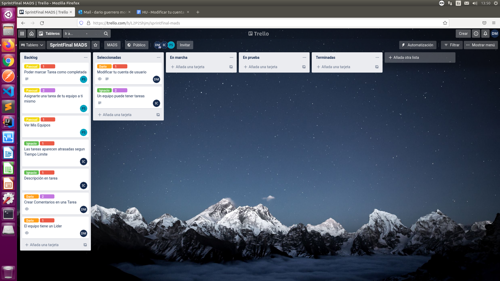
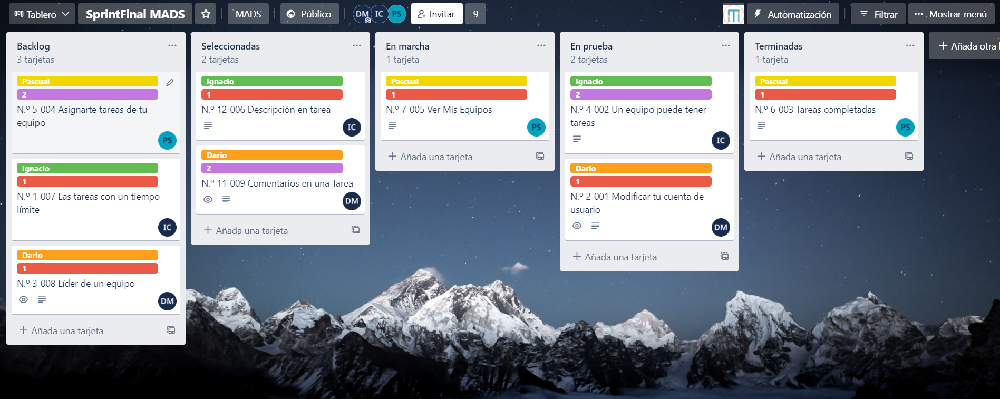
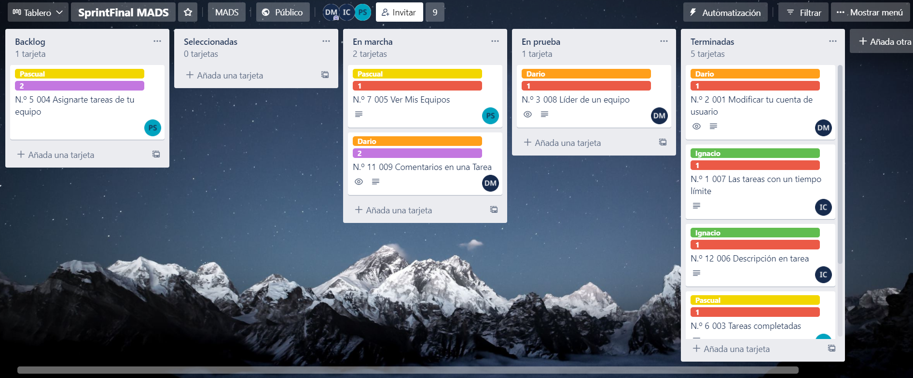
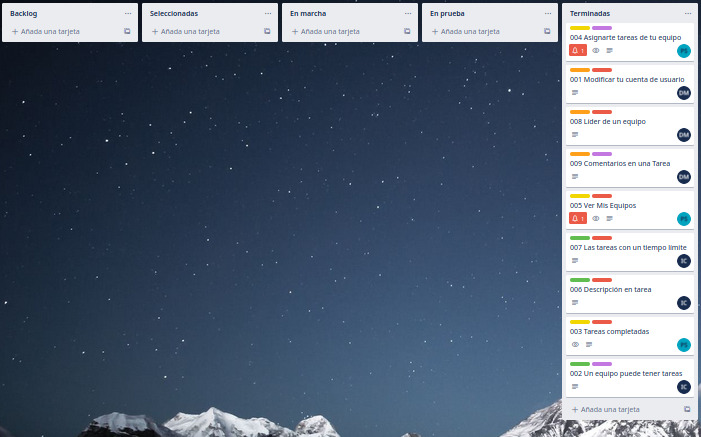

# Practica 4

## Repositorios
[Docker](https://hub.docker.com/repository/docker/dargue94/mads-todolist-equipo11)
[Github](https://github.com/mads-ua-21-22/todolist-equipo-11)
[Trello](https://trello.com/b/SVVvfCcB/todolist-mads)

## *Resumen*
En esta práctica hemos agregado nuevas funcionalidades que han sido pensadas por 
los miembros del equipo para tratar de mejorar la aplicación ToDoList y aprender a trabajar en equipo utilizando metodologías tales como XP y prácticas 
de esta como *Pair Programming*.

Se han desarrollado nuevas funcionalidades como comentar tareas, fecha límite de tareas o asignarte tareas de tu equipo que explicaremos más adelante.

## *Desarrollo de Trello*
Este es el desarrollo de nuestro proyecto durante estas cuatro semanas de duración en cuanto a realización de historias de usuario se refiere:
- Semana 1:


- Semana 2


- Semana 3:


- Semana 4:


## *Forma de trabajar y Pair Programming*
Hemos trabajado de la forma que hemos ido siguiendo en las prácticas anteriores: 
creábamos una nueva rama a partir de *Develop* en lugar de *Main*, y para cada funcionalidad se 
trabajaba en una rama distinta. Respecto al código hemos trabajado
comenzando con el Objeto/Service y después con el Controller, Vista y por último tests
en caso de ser necesario, aunque en algunos casos se ha llegado a utilizar TDD debido a su sencilla forma de implementar código.
> Dado que en esta práctica lo que hemos hecho ha sido ampliar funcionalidades, hay tests que han sido refactorizados ligeramente en lugar de crear un nuevo test.

Respecto al **Pair Programming**, lo hemos utilizado en algunas ocasiones por
ser una forma de trabajar que nos ha gustado bastante en general, ya que permite trabajar de una forma más neutra, porque dos personas no programan igual,
y así conseguimos un código más limpio. Además, cuando uno de los miembros comete algún
error es más fácil solucionarlo (*dos cabezas suelen pensar mejor que una y cuatro ojos ver mejor que dos*).

## *Listado de nuevas features*

### Equipos tienen un Líder

Esta funcionalidad trata de crear un líder el cuál será quien tenga el poder de añadir, editar o eliminar tareas a un equipo, así como eliminar a usuarios de el equipo del que es líder.
Adicionalmente, hemos hecho que las Tareas de un equipo que ya se veian(otra funcionalidad) aparezcan únicamente si eres miembro del equipo.

Para esta funcionalidad podemos encontrar las vistas:

* infotareaequipo
* formEditarTareaEquipo
* formNuevaTareaEquipo

El código asociado (a modo de resumen) es el siguiente:

Se hacen numerosas comprobaciones de dos tipos: si un usuario aparece en el listado de usuarios que devuelve un equipo y si el usuario que ha iniciado la sesion, es el líder.

Esta primera se utiliza para saber si podrá ver las tareas de un equipo, asi como para evitar su acceso a la tarea a través de la URL.
``` java
 if(equipo.getUsuarios().contains(usuario))
```

Por otro lado, esta comprobación nos permitirá dar más controles al líder, ya sea con la aparición de botonoes como el de Agregar Tarea, como la posibilidad de poder editar la tarea de un equipo desde "infotarea"
``` java
equipo.getLider() != usuario
```

Estos son algunos ejemplos en código:
``` java
@GetMapping("/equipos/{equipo}/tareas/{id}")
public String formTareaEquipo(@PathVariable(value = "equipo") Long idEquipo,@PathVariable(value = "id") Long idTarea, @ModelAttribute TareaData tareaData,
                        Model model, HttpSession session) {
    Tarea tarea = tareaService.findById(idTarea);
    if (tarea == null)
        throw new TareaNotFoundException();

    Usuario usuario = usuarioService.findById(managerUserSession.usuarioLogeado(session));
    Equipo equipo = equipoService.findById(idEquipo);

    if(!equipo.getUsuarios().contains(usuario))
        throw new UsuarioNotFoundException();
    if(!equipo.getTareas().contains(tarea))
        throw new TareaNotFoundException();
    model.addAttribute("equipo",equipo);
    model.addAttribute("usuario",usuario);
    model.addAttribute("tarea",tarea);
    model.addAttribute("comentarios",comentarioService.allComentariosTarea(tarea.getId()));
    tareaData.setTitulo(tarea.getTitulo());
    tareaData.setDescripcion(tarea.getDescripcion());
    return "infotareaequipo";
}
```

``` java
@GetMapping("/equipos/{id}/tareas/nueva")
public String formNuevaTarea(@PathVariable(value = "id") Long idEquipo,
@ModelAttribute TareaData tareaData,Model model,
HttpSession session) {
Long idUsuario = (Long) session.getAttribute("idUsuarioLogeado");
managerUserSession.comprobarUsuarioLogeado(session,idUsuario);

        Usuario usuario = usuarioService.findById(idUsuario);
        if(usuario == null)
            throw new UsuarioNotFoundException();
        Equipo equipo = equipoService.findById(idEquipo);
        if(equipo.getLider() != usuario)
            throw new UsuarioNotFoundException();

        model.addAttribute("usuario",usuario);
        model.addAttribute("equipo",equipo);
        return "formNuevaTareaEquipo";
    }
````
### Podemos modificar nuestros datos de Usuario

Lo que se ha realizado en esta funcionalidad es darle uso a un boton que teníamos si utilizar todavía en el NavBar.

Para realizar esta función, hemos creado ModificaData con los siguientes parametros:
Cabe destacar el uso de 3 contraseñas, 2 hacen referencia a la nueva por lo que tendrán que ser iguales y 1 hace referencia a la Actual.

``` java
private String actualpassword;
private String password;
private String password2;
private String nombre;
@DateTimeFormat(pattern = "yyyy-MM-dd")
private Date fechaNacimiento;
```

Y tras el Data se ha creado el controllador para acceder a la vista y obtener los datos del formulario:
``` java
@GetMapping("/modificarPerfil")
public String modificarPerfil(@ModelAttribute ModificaData modificaData,Model model, HttpSession session) {
//Para comprobar si el usuario si existe y si esta logeado (Evitar error null)
Long idUsuario = (Long) session.getAttribute("idUsuarioLogeado");

    managerUserSession.comprobarExisteUsuario(idUsuario);
    managerUserSession.comprobarUsuarioLogeado(session,idUsuario);
    //Comprobamos usuario de la SESION
    Usuario usuarioSesion = usuarioService.findById(idUsuario);
    if (usuarioSesion == null) {
        throw new UsuarioNotFoundException();
    }
    model.addAttribute("user",usuarioSesion);
    modificaData.setNombre(usuarioSesion.getNombre());
    modificaData.setPassword("");
    modificaData.setActualpassword("");
    modificaData.setPassword2("");
    modificaData.setFechaNacimiento(usuarioSesion.getFechaNacimiento());
    return "formModificaCuenta";
}
```

``` java
@PostMapping("/modificarPerfil")
public String modificarPerfil(@Valid ModificaData modificaData, BindingResult result, Model model,
    HttpSession session) {

    Long idUsuario = (Long) session.getAttribute("idUsuarioLogeado");
    Usuario user = usuarioService.findById(idUsuario);
    model.addAttribute("user",user);
    model.addAttribute("modificaData", new ModificaData());

    if (result.hasErrors()) {
        model.addAttribute("error", "Asegurate de que el formato de la fecha es DD-MM-YYYY");
        return "formModificaCuenta";
    }

    if(!modificaData.getActualpassword().equals(user.getPassword())) {
        model.addAttribute("error", "La contraseña actual es errónea");
        return "formModificaCuenta";
    }
    else if(!modificaData.getPassword().equals(modificaData.getPassword2())) {
        model.addAttribute("error", "Las contraseñas no coinciden ");
        return "formModificaCuenta";
    }
    user.setPassword(modificaData.getPassword());
    user.setFechaNacimiento(modificaData.getFechaNacimiento());
    user.setNombre(modificaData.getNombre());
    usuarioService.modificar(user);
    return "redirect:/modificarPerfil";
}
```

Algo a tener en cuenta fue la modificación de Fecha para que aparezca el calendario al Clicar en el input, por lo que estos son los códigos asociados a dicho cambio:
``` java
@DateTimeFormat(pattern = "yyyy-MM-dd")
private Date fechaNacimiento;
````

``` html
<input id="fechaNacimiento" class="form-control" name="fechaNacimiento"
       th:field="*{fechaNacimiento}" type="date"/>
````

Ademas cabe destacar que en la vista, los inputs aparecen como Requeridos, por lo que no puedes dejar ninguno en blanco.

### Podemos comentar en las tareas

Se puede comentar en las Tareas de uno mismo asi como en las tareas de un equipo si aparecemos en la lista de usuarios de dicho equipo.
Para comentar las tareas se ha tenido que crear un objeto relacionado con Tareas y Usuarios y no aceptara nulo en estos campos.

Se ha creado un service para guardar los comentarios en una Tarea y otro para obtener todos los comentarios de una Tarea.
Dado que bastante código es parecido a otro que ya se ha mostrado, pasamos a los Tests:

Se han realizado tests para comprobar el funcionamiento del Objeto y del Servicio ya que la Web es comprobada en otros.

Los tests del objeto comprueban su conexión con la base de datos.

Los tests del Service comprueba si funciona correctamente FindAll, la obtencion de comentarios así como su agregación a una tarea ya existente.

Tests de ejemplo:

``` java
    @Test
    public void comprobarRecuperarComentario() {

        Comentario comentario = comentarioRepository.findById(1L).orElse(null);

        // THEN
        assertThat(comentario).isNotNull();
        assertThat(comentario.getId()).isEqualTo(1L);
        assertThat(comentario.getComentario()).isEqualTo("Un comentario más");
    }
```

``` java
    @Test
    @Transactional
    public void creaComentarios() {
        List<Comentario> comentarios = comentarioService.allComentariosTarea(1L);
        // THEN
        assertThat(comentarios).hasSize(1);
        Comentario comentario = new Comentario(usuarioService.findById(1L),
        tareaService.findById(1L),"Otro comentario");
        Tarea tarea = tareaService.findById(1L);
        assertThat(tarea.getComentarios()).hasSize(2);
    }
```

### Los equipos tienen tareas
Esta funcionalidad trata de que los equipos peuden tener tareas asociadas.
Es decir, ahora los equipos tienen tareas independientes a las del usuario y de esta forma todos los miembros
del equipo podrán consultarlas, completarlas y si según si el usuario es líder o no podrá asígnarle las tareas a otro
usuario, para que la compleete otro usuario, crear nuevas tareas, editarlas o eliminarlas.

Para esta funcionalidad hemos añadido las siguientes vistas:

* infotareaequipo
* formNuevaTareaEquipo

Y editamos vistas ya creadas anteriormente:
* infoEquipo

Se hacen diversas comprobaciones: si un usuario pertenecen a un equipo o si un usuario es líder del equipo, entre otras.

Esta primera se hace para saber si podrá ver las tareas de un equipo, asi como para evitar su accesso a la tarea a través
de la URL.

``` java
if(!equipo.getUsuarios().contains(usuario))
            throw new UsuarioNotFoundException();
```
También comprobamos que la tarea pertenece al equipo.
``` java
if(!equipo.getTareas().contains(tarea))
    throw new TareaNotFoundException();
```
Se le ha añadido a la vista de información del Equipo una vista de las diferentes tareas que pertenecen a dicho equipo.
Esto se consigue con el siguiente HTML:
``` html
<div class="col">
    <div th:replace="fragments :: tablaEquipoTareas(equipo=${equipo},usuario=${usuario},tareas=${tareasNoCompletadas}, titulo='Tareas no completadas')"></div>
    <div th:if="${tareasNoCompletadas.size() == 0}" class="alert alert-info" role="alert">
        No tienes tareas por hacer. ¡Empieza ahora!
    </div>
    <div th:replace="fragments :: tablaEquipoTareas(equipo=${equipo}, usuario=${usuario}, tareas=${tareasCompletadas}, titulo='Tareas completadas')"></div>
</div>
```
Además como se explica antes el Líder de un equipo tiene la capacidad de añadir, borrar y editar las tareas de un equipo.
``` html
<th th:if="${usuario.getAdministrador()} or ${equipo.getLider() == usuario}" >Accion</th>
```
``` html
<a th:if="${equipo.getLider() == usuario}" class="btn btn-primary float-right d-inline" th:href="@{/equipos/{id}/tareas/nueva(id=${equipo.id})}">
    <i class="fas fa-plus"></i>
</a>
```

### Podemos consultar toda la información de las tareas
Las tareas tienen una pequeña descripción en la cual se pueden consultar la información de cada una de las tareas.

Además de consultar la información se le ha añadido una pequeña descripción para que nos arroje más detalles sobre la
realización de la tarea.
``` java
@Entity
@Table(name = "tareas")
public class Tarea implements Serializable {

    private static final long serialVersionUID = 1L;

    @Id
    @GeneratedValue(strategy = GenerationType.IDENTITY)
    private Long id;
    @NotNull
    private String titulo;

    ...
    
    private String descripcion;

    ...

    public String getDescripcion() { return  descripcion; }

    public void setDescripcion(String descripcion){ this.descripcion = descripcion; }

    ...
}
```

Entonces al añadirle esta pequeña descripción se le ha añadido a la hora de crear una tarea la opción de completarla con
descripción.

Y a la hora de editar la información de la tarea también se va a poder modificar la descripción de esta.

Pero lo importante es poder observar toda la información de dicha tarea por lo tanto se ha creado la vista de *infotarea*
para poder consultar dicha información.
### Las tareas tienen una fecha límite de realización
Al crear una tarea se le puede añadir una fecha límite para la realización de la tarea que se está creando. De igual 
al editar tarea también se puede editar la fecha límite de esta.
``` java
@Entity
@Table(name = "tareas")
public class Tarea implements Serializable {

    private static final long serialVersionUID = 1L;

    ...

    @Column(name = "fecha_limite")
    @Temporal(TemporalType.DATE)
    @DateTimeFormat(pattern = "yyyy-MM-dd")
    private Date fechaLimite;

    ...

    public Date getFechaLimite() { return  fechaLimite; }

    public void setFechaLimite(Date fechaLimite) { this.fechaLimite = fechaLimite; }

    public boolean retrasada() {
        java.util.Date fecha = new Date();
        if(fecha.compareTo(fechaLimite) == -1)
            return false;
        else
            return true;
    }

    public boolean nofechaLimite() { return  fechaLimite == null; }

    ...
}
```
Esta fecha límite se mostrará también en la información de la tarea antes mencionada así mismo en la vista creada para 
mostrar dicha información, *infotarea*.

Pero para una mayor visualización del estado de la tarea respecto a la fecha limite hemos implementado en la vista en la 
cual se muestran el listado de las tareas si dicha tarea esta todavía en curso o va retrasada respecto a la fecha actual.
``` html
<div th:if="${!tarea.isComplete()}">
    <div th:if="${!tarea.nofechaLimite()}">
        <p class="text-danger" th:if="${tarea.retrasada()}">Retrasada!</p>
        <p class="text-success" th:if="${!tarea.retrasada()}">En Curso</p>
    </div>
</div>
```


### Completar tareas
¡Se pueden completar tareas! Una vez una tarea se ha llevado a cabo, lo más lógico es borrarla y ya... ¿pero y si queremos llevar un registro de todas las tareas que hemos llevado a cabo en un tiempo?

Por eso se hha añadido la función de completar tareas. Todas las tareas, ya sean de equipo o de usuario, al crearse serán tareas por completar. El usuario encargado
de la tarea podrá darla por concluida cuando lo desee.

En la vista, en la lista de tareas, aparecerá un botón que realizará la acción de completar la función, es decir, completar la tarea.
``` html
<p class="text-success" th:if="${tarea.isComplete()}">¡Tarea realizada!</p>
<form th:if="${!tarea.isComplete()}" method="post" th:action="@{/tareas/{id}/completada(id=${tarea.getId()})}" >
    <button class="btn btn-warning" type="submit">
        <i class="fas fa-check"></i>
    </button>
</form>
```

Si ya se ha completado, se mostrará un texto informativo.

Al pulsar el botón, como hemos mencionado antes, pasa al método ***POST /tarea/id/completada***, donde se hace llamada al servicio de la tarea
después de comprobar que es el usuario perteneciente a la tarea el que realiza la terea  y está autorizado.

``` java
@Transactional
public void completaTarea(Tarea tarea) {
    tarea.setComplete();
}
```

### Visualizar tareas completadas
Hemos querido clasificar las tareas entre completadas y no completadas en la vista general de tareas para que estas
sean más fáciles de detectar. En la vista tenemos dos tablas, las correspondientes a las tareas no completadas y completadas, pudiendo realizar cualquiera de las
acciones anteriores que haciamos con las teareas (completar, editar, eliminar...).

En el servicio de tarea hemos añadido las funciones getAll tanto de ordenadas como de no ordenadas, tanto para el usuario como para el equipo:
``` java
public ArrayList<Tarea> allTareasCompletadasUsuario(Long idUsuario) {
    return new ArrayList(tareaRepository.allTareasCompletadas(idUsuario));
}

public ArrayList<Tarea> allTareasNoCompletadasUsuario(Long idUsuario) {
    return new ArrayList(tareaRepository.allTareasNoCompletadas(idUsuario));
}

public ArrayList<Tarea> allTareasCompletadasEquipo(Long idEquipo){
    return new ArrayList(tareaRepository.allTareasCompletadasEquipo(idEquipo));
}

public ArrayList<Tarea> allTareasNoCompletadasEquipo(Long idEquipo){
    return  new ArrayList(tareaRepository.allTareasNoCompletadasEquipo(idEquipo));
}
```

Que en el repository ya realizan la búsqueda correspondiente en la base de datos:

``` java
@Query(value = "SELECT * from tareas where completada = true and usuario_id = ?1", nativeQuery = true)
List<Tarea> allTareasCompletadas(Long idUsuario);

@Query(value = "SELECT * from tareas where completada = false and usuario_id = ?1", nativeQuery = true)
List<Tarea> allTareasNoCompletadas(Long idUsuario);

@Query(value = "SELECT * from tareas where completada = true and equipo_id = ?1", nativeQuery = true)
List<Tarea> allTareasCompletadasEquipo(Long idEquipo);

@Query(value = "SELECT * from tareas where completada = false and equipo_id = ?1", nativeQuery = true)
List<Tarea> allTareasNoCompletadasEquipo(Long idEquipo);
```

En cuanto a test, se han llevado a cabo test del modelo y del servicio para que la lógica funcione y se compruebe correctamente.
Ya en cuanto a test de web se han implementado para comprobar que lo mostrado sea lo correcto.

Cabe destacar la implementación adicional de una barra de estado que
muestra el baremo entre las completadas y las no completadas,
dando un dato óptimo y ánimo al usuario para que este lo tenga en cuenta con un simple vistazo.

``` html
<div class="container-fluid mt-4">
    <meter id="progreso" class="progress progress-bar d-inline" style="width: 200px;" th:value="${porcentajeCompletadas}"></meter>
    <label class="ml-3 text-danger d-inline" style="font-size: 14px" for="progreso" th:if="${porcentajeCompletadas < 0.3}">Quedan muchas por hacer...</label>
    <label class="text-warning ml-3 d-inline" style="font-size: 14px" for="progreso" th:if="${porcentajeCompletadas < 0.7 && porcentajeCompletadas >= 0.3}">¡Vas en buen camino!</label>
    <label class="text-info ml-3 d-inline" style="font-size: 14px" for="progreso" th:if="${porcentajeCompletadas >= 0.7 && porcentajeCompletadas < 0.99}">¡Casi lo tienes!</label>
    <label class="text-success ml-3 d-inline" style="font-size: 14px" for="progreso" th:if="${porcentajeCompletadas == 1}">¡Todas hechas!</label>
</div>
```

### Asignarte tareas de tu equipo
En la vista de **Mis Equipos**, un usuario podrá ver aquellas tareas que aún están sin asignar, pudiendo
asignárselas a  él mismo. Simplemente se añade pulsando un botón y ya se le asigna la tareas al usuario, a parte de al equipo.

En cuanto la vista:
``` java
<div th:unless="${tarea.getUsuario() == tarea.getEquipo().getLider()}">
    <i class="fas fa-user mr-2 mt-1"></i>
    <b th:text="${tarea.getUsuario().getNombre()}"></b>
</div>
<form th:action="@{/tareas/{id}/cambiarUsuario(id=${tarea.getId()})}" th:if="${tarea.getUsuario() == tarea.getEquipo().getLider() && tarea.getUsuario() != usuario}" method="post" >
    <button type="submit" class="btn btn-primary btn-sm"><i class="fas fa-plus mr-2 mt-1"></i></button>
</form>
```
Básicamente muestra el nombre del usuario si es que lo tuviera, y si no, es disponible para ser asignado a cualquier usuario del equipo.

Ya en el controlador, solamente cambiamos el usuario de la tarea mediante la llamada al servicio.

``` java
@Transactional
public boolean cambiarUsuarioTarea(Long idTarea, Long idUsuario){
    Tarea tarea = tareaRepository.findById(idTarea).orElse(null);
    Usuario usuario = usuarioRepository.findById(idUsuario).orElse(null);

    // Comprobar si la tarea y el usuario existen
    if(tarea == null) {
        throw new TareaNotFoundException();
    } else if(usuario == null){
        throw new UsuarioNotFoundException();
    } else {
        // Comprobar que son del mismo equipo y el usuario es el lider
        if(usuario.getEquipos().contains(tarea.getEquipo()) &&
        tarea.getUsuario() == tarea.getEquipo().getLider()){
            tarea.setUsuario(usuario);
            return true;
        }
    }
    // algo ha fallado y no se ha podido cambiar
    return false;
}
```


## *Detalles del despliegue de producción*
El despliegue de producción se ha generado desde alu21.

Los scripts de .sql se encuentran en *mi-host*. Uno es el principal **schema-final.sql** y el otro es **schema-final-X.sql**.