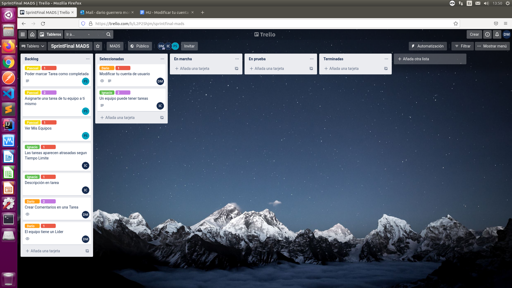
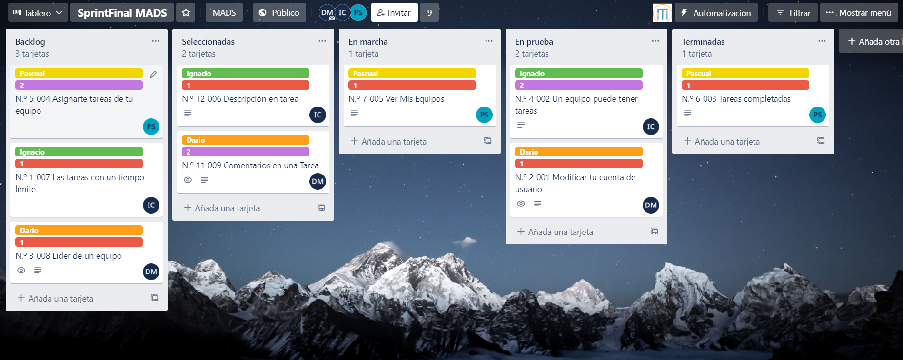
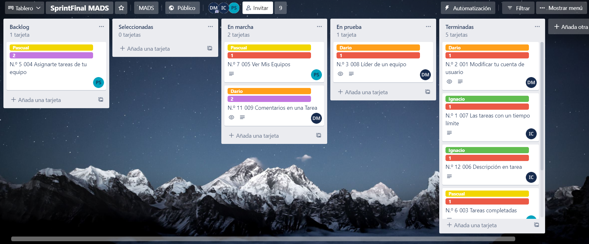

# Practica 4

## Repositorios
[Repositorios en Docker](https://hub.docker.com/repository/docker/dargue94/mads-todolist-equipo11)

[Github](https://github.com/mads-ua-21-22/todolist-equipo-11)

[Trello](https://trello.com/b/SVVvfCcB/todolist-mads)

## *Resumen*
En esta práctica hemos agregado nuevas funcionalidades que han sido pensadas entre los miembros del equipo para tratar de mejorar la Web y aprender a trabajar en equipo.

## *Desarrollo de Trello*
Semana 1:


Semana 2:


Semana 3:


Semana 4:

## *Forma de trabajar y Pair Programming*
Hemos trabajado de la forma que hemos ido siguiendo en las prácticas anteriores: creabamos una nueva rama a partir de Develop en lugar de Main, y para cada funcionalidad se trabajaba en una rama distinta. Respecto al código hemos trabajado principal comenzando con el Objeto/Service y después con el Controller, Vista y por último tests en caso de ser necesario.
Dado que en esta práctica lo que hemos hecho ha sido ampliar funcionalidades, hay tests que han sido refactorizados ligeramente en lugar de crear un nuevo test.

Respecto al Pair Programming, lo hemos utilizado en algunas ocasiones ya que es una forma de trabajar que nos ha gustado ya que permite dividir el trabajo entre los miembros que la realizan y, además, cuando uno de los miembros comete algún error es más facil solucionarlo.

## *Listado de nuevas features*
* Los equipos tienen un Lider
* Podemos modificar nuestros datos de Usuario
* Podemos comentar en las tareas
* Los equipos tienen tareas
* Podemos consultar toda la información de las tareas
* Las tareas tienen una fecha límite de realización

### Equipos tienen un Lider

Esta funcionalidad trata de crear un Lider el cuál será quien tenga el poder de añadir, editar o eliminar tareas a un equipo, así como eliminar a usuarios de el equipo del que es lider.
Adicionalmente, hemos hecho que las Tareas de un equipo que ya se veian(otra funcionalidad) aparezcan únicamente si eres miembro del equipo.

Para esta funcionalidad podemos encontrar las vistas:

* infotareaequipo
* formEditarTareaEquipo
* formNuevaTareaEquipo

El código asociado (a modo de resumen) es el siguiente:

Se hacen numerosas comprobaciones de dos tipos: si un usuario aparece en el listado de usuarios que devuelve un equipo y si el usuario que ha iniciado la sesion, es el Lider.

Esta primera se utiliza para saber si podrá ver las tareas de un equipo, asi como para evitar su acceso a la tarea a través de la URL.
```javascript
 if(equipo.getUsuarios().contains(usuario))
`````

Por otro lado, esta comprobación nos permitirá dar más controles al Lider, ya sea con la aparición de botonoes como el de Agregar Tarea, como la posibilidad de poder editar la tarea de un equipo desde "infotarea"
```javascript
equipo.getLider() != usuario
`````

Estos son algunos ejemplos en código:
```javascript
 @GetMapping("/equipos/{equipo}/tareas/{id}")
    public String formTareaEquipo(@PathVariable(value = "equipo") Long idEquipo,@PathVariable(value = "id") Long idTarea, @ModelAttribute TareaData tareaData,
                            Model model, HttpSession session) {
        Tarea tarea = tareaService.findById(idTarea);
        if (tarea == null)
            throw new TareaNotFoundException();

        Usuario usuario = usuarioService.findById(managerUserSession.usuarioLogeado(session));
        Equipo equipo = equipoService.findById(idEquipo);

        if(!equipo.getUsuarios().contains(usuario))
            throw new UsuarioNotFoundException();
        if(!equipo.getTareas().contains(tarea))
            throw new TareaNotFoundException();
        model.addAttribute("equipo",equipo);
        model.addAttribute("usuario",usuario);
        model.addAttribute("tarea",tarea);
        model.addAttribute("comentarios",comentarioService.allComentariosTarea(tarea.getId()));
        tareaData.setTitulo(tarea.getTitulo());
        tareaData.setDescripcion(tarea.getDescripcion());
        return "infotareaequipo";
    }
`````

```javascript
@GetMapping("/equipos/{id}/tareas/nueva")
public String formNuevaTarea(@PathVariable(value = "id") Long idEquipo,
@ModelAttribute TareaData tareaData,Model model,
HttpSession session) {
Long idUsuario = (Long) session.getAttribute("idUsuarioLogeado");
managerUserSession.comprobarUsuarioLogeado(session,idUsuario);

        Usuario usuario = usuarioService.findById(idUsuario);
        if(usuario == null)
            throw new UsuarioNotFoundException();
        Equipo equipo = equipoService.findById(idEquipo);
        if(equipo.getLider() != usuario)
            throw new UsuarioNotFoundException();

        model.addAttribute("usuario",usuario);
        model.addAttribute("equipo",equipo);
        return "formNuevaTareaEquipo";
    }
````
### Podemos modificar nuestros datos de Usuario

Lo que se ha realizado en esta funcionalidad es darle uso a un boton que teníamos si utilizar todavía en el NavBar.

Para realizar esta función, hemos creado ModificaData con los siguientes parametros:
Cabe destacar el uso de 3 contraseñas, 2 hacen referencia a la nueva por lo que tendrán que ser iguales y 1 hace referencia a la Actual.

```javascript
private String actualpassword;
    private String password;
    private String password2;
    private String nombre;
    @DateTimeFormat(pattern = "yyyy-MM-dd")
    private Date fechaNacimiento;
````

Y tras el Data se ha creado el controllador para acceder a la vista y obtener los datos del formulario:
```javascript
@GetMapping("/modificarPerfil")
public String modificarPerfil(@ModelAttribute ModificaData modificaData,Model model, HttpSession session) {
//Para comprobar si el usuario si existe y si esta logeado (Evitar error null)
Long idUsuario = (Long) session.getAttribute("idUsuarioLogeado");

        managerUserSession.comprobarExisteUsuario(idUsuario);
        managerUserSession.comprobarUsuarioLogeado(session,idUsuario);
        //Comprobamos usuario de la SESION
        Usuario usuarioSesion = usuarioService.findById(idUsuario);
        if (usuarioSesion == null) {
            throw new UsuarioNotFoundException();
        }
        model.addAttribute("user",usuarioSesion);
        modificaData.setNombre(usuarioSesion.getNombre());
        modificaData.setPassword("");
        modificaData.setActualpassword("");
        modificaData.setPassword2("");
        modificaData.setFechaNacimiento(usuarioSesion.getFechaNacimiento());
        return "formModificaCuenta";
    }
 ````

```javascript
    @PostMapping("/modificarPerfil")
public String modificarPerfil(@Valid ModificaData modificaData, BindingResult result, Model model,
    HttpSession session) {

    Long idUsuario = (Long) session.getAttribute("idUsuarioLogeado");
    Usuario user = usuarioService.findById(idUsuario);
    model.addAttribute("user",user);
    model.addAttribute("modificaData", new ModificaData());

    if (result.hasErrors()) {
        model.addAttribute("error", "Asegurate de que el formato de la fecha es DD-MM-YYYY");
        return "formModificaCuenta";
    }

    if(!modificaData.getActualpassword().equals(user.getPassword())) {
        model.addAttribute("error", "La contraseña actual es errónea");
        return "formModificaCuenta";
    }
    else if(!modificaData.getPassword().equals(modificaData.getPassword2())) {
        model.addAttribute("error", "Las contraseñas no coinciden ");
        return "formModificaCuenta";
    }
    user.setPassword(modificaData.getPassword());
    user.setFechaNacimiento(modificaData.getFechaNacimiento());
    user.setNombre(modificaData.getNombre());
    usuarioService.modificar(user);
    return "redirect:/modificarPerfil";
}
 ````

Algo a tener en cuenta fue la modificación de Fecha para que aparezca el calendario al Clicar en el input, por lo que estos son los códigos asociados a dicho cambio:
```javascript
@DateTimeFormat(pattern = "yyyy-MM-dd")
    private Date fechaNacimiento;
````

```javascript
<input id="fechaNacimiento" class="form-control" name="fechaNacimiento"
       th:field="*{fechaNacimiento}" type="date"/>
````

Ademas cabe destacar que en la vista, los inputs aparecen como Requeridos, por lo que no puedes dejar ninguno en blanco.

### Podemos comentar en las tareas

Se puede comentar en las Tareas de uno mismo asi como en las tareas de un equipo si aparecemos en la lista de usuarios de dicho equipo.
Para comentar las tareas se ha tenido que crear un objeto relacionado con Tareas y Usuarios y no aceptara nulo en estos campos.

Se ha creado un service para guardar los comentarios en una Tarea y otro para obtener todos los comentarios de una Tarea.
Dado que bastante código es parecido a otro que ya se ha mostrado, pasamos a los Tests:

Se han realizado tests para comprobar el funcionamiento del Objeto y del Servicio ya que la Web es comprobada en otros.

Los tests del objeto comprueban su conexión con la base de datos.

Los tests del Service comprueba si funciona correctamente FindAll, la obtencion de comentarios así como su agregación a una tarea ya existente.

Tests de ejemplo:

```javascript
    @Test
    public void comprobarRecuperarComentario() {

        Comentario comentario = comentarioRepository.findById(1L).orElse(null);

        // THEN
        assertThat(comentario).isNotNull();
        assertThat(comentario.getId()).isEqualTo(1L);
        assertThat(comentario.getComentario()).isEqualTo("Un comentario más");
    }
```

```javascript
    @Test
    @Transactional
    public void creaComentarios() {
        List<Comentario> comentarios = comentarioService.allComentariosTarea(1L);
        // THEN
        assertThat(comentarios).hasSize(1);
        Comentario comentario = new Comentario(usuarioService.findById(1L),
        tareaService.findById(1L),"Otro comentario");
        Tarea tarea = tareaService.findById(1L);
        assertThat(tarea.getComentarios()).hasSize(2);
    }
```
###Los equipos tienen tareas
Esta funcionalidad trata de que los equipos peuden tener tareas asociadas.
Es decir, ahora los equipos tienen tareas independientes a las del usuario y de esta forma todos los miembros
del equipo podrán consultarlas, completarlas y si según si el usuario es líder o no podrá asígnarle las tareas a otro
usuario, para que la compleete otro usuario, crear nuevas tareas, editarlas o eliminarlas.

Para esta funcionalidad hemos añadido las siguientes vistas:

* infotareaequipo
* formNuevaTareaEquipo

Y editamos vistas ya creadas anteriormente:
* infoEquipo

Se hacen diversas comprobaciones: si un usuario pertenecen a un equipo o si un usuario es líder del equipo, entre otras.

Esta primera se hace para saber si podrá ver las tareas de un equipo, asi como para evitar su accesso a la tarea a través
de la URL.

```javascript
if(!equipo.getUsuarios().contains(usuario))
            throw new UsuarioNotFoundException();
```
También comprobamos que la tarea pertenece al equipo.
```javascript
if(!equipo.getTareas().contains(tarea))
    throw new TareaNotFoundException();
```
Se le ha añadido a la vista de información del Equipo una vista de las diferentes tareas que pertenecen a dicho equipo.
Esto se consigue con el siguiente HTML:
```html
<div class="col">
    <div th:replace="fragments :: tablaEquipoTareas(equipo=${equipo},usuario=${usuario},tareas=${tareasNoCompletadas}, titulo='Tareas no completadas')"></div>
    <div th:if="${tareasNoCompletadas.size() == 0}" class="alert alert-info" role="alert">
        No tienes tareas por hacer. ¡Empieza ahora!
    </div>
    <div th:replace="fragments :: tablaEquipoTareas(equipo=${equipo}, usuario=${usuario}, tareas=${tareasCompletadas}, titulo='Tareas completadas')"></div>
</div>
```
Además como se explica antes el Líder de un equipo tiene la capacidad de añadir, borrar y editar las tareas de un equipo.
```html
<th th:if="${usuario.getAdministrador()} or ${equipo.getLider() == usuario}" >Accion</th>
```
```html
<a th:if="${equipo.getLider() == usuario}" class="btn btn-primary float-right d-inline" th:href="@{/equipos/{id}/tareas/nueva(id=${equipo.id})}">
    <i class="fas fa-plus"></i>
</a>
```
## *Detalles del despliegue de producción*
El despliegue de producción se ha generado desde alu21.

Los scripts de .sql se encuentran en mi-host. Uno es el principal schema-final.sql y el otro es schema-final-X.sql